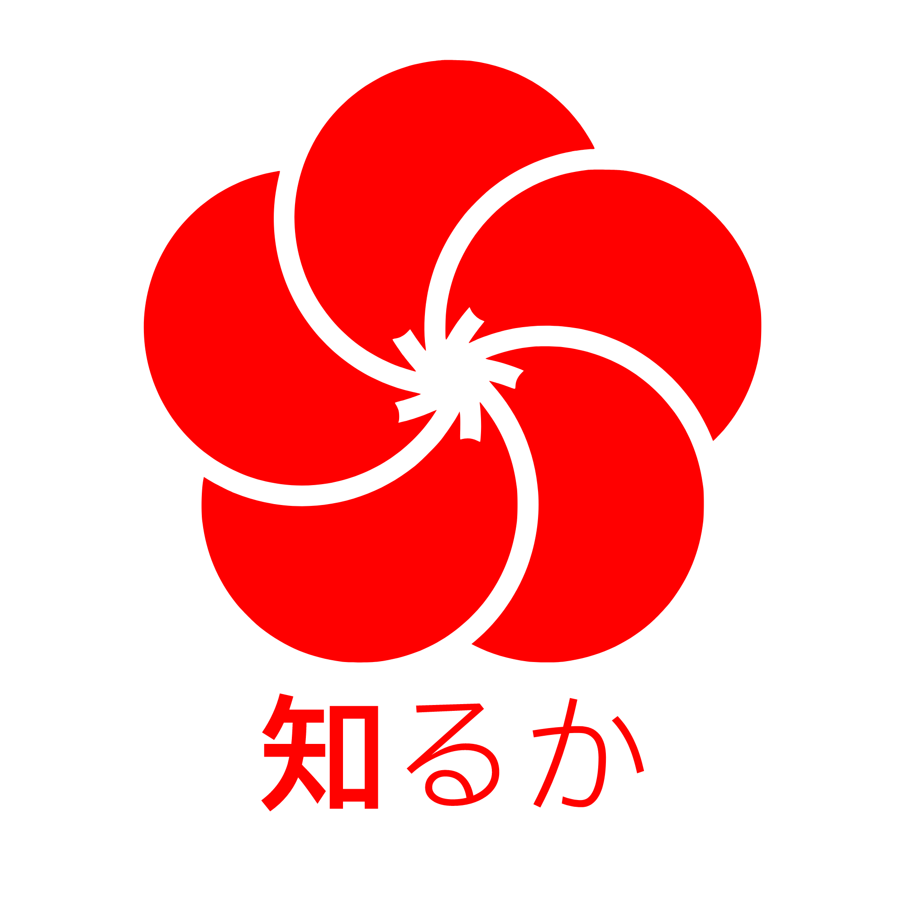

<h1 align="center">Shiru ka</h1>

<strong>A fully open-source server software for Minecraft: Bedrock Edition.</strong>

<h3 align="center">
  <a href="https://shiruka.github.io">Documentation</a>
/
  <a href="https://discord.gg/VacpRnazaS">Discord</a> 
/
  <a href="https://crowdin.com/project/shiru-ka">Translation</a>
/
  <a href="https://github.com/shiruka/shiruka/releases/latest/download/Shiruka.jar">Download</a>
</h3>
